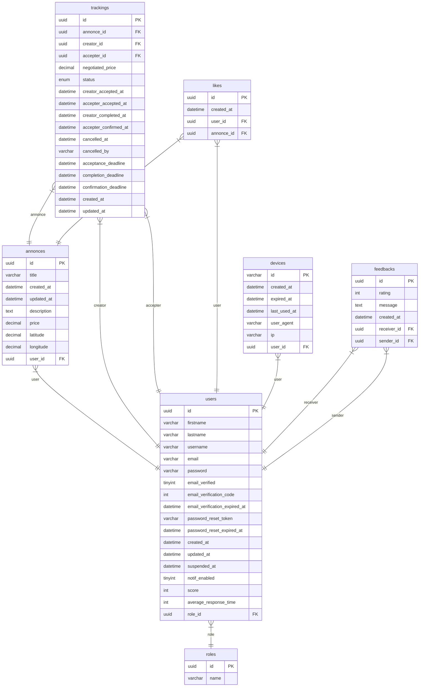

```mermaid
erDiagram
  roles {
    uuid id PK
    varchar name
  }
  users {
    uuid id PK
    varchar firstname
    varchar lastname
    varchar username
    varchar email
    varchar password
    tinyint email_verified
    int email_verification_code
    datetime email_verification_expired_at
    varchar password_reset_token
    datetime password_reset_expired_at
    datetime created_at
    datetime updated_at
    datetime suspended_at
    tinyint notif_enabled
    int score
    int average_response_time
    uuid role_id FK
  }
  annonces {
    uuid id PK
    varchar title
    datetime created_at
    datetime updated_at
    text description
    decimal price
    decimal latitude
    decimal longitude
    uuid user_id FK
  }
  trackings {
    uuid id PK
    uuid annonce_id FK
    uuid creator_id FK
    uuid accepter_id FK
    decimal negotiated_price
    enum status
    datetime creator_accepted_at
    datetime accepter_accepted_at
    datetime creator_completed_at
    datetime accepter_confirmed_at
    datetime cancelled_at
    varchar cancelled_by
    datetime acceptance_deadline
    datetime completion_deadline
    datetime confirmation_deadline
    datetime created_at
    datetime updated_at
  }
  likes {
    uuid id PK
    datetime created_at
    uuid user_id FK
    uuid annonce_id FK
  }
  devices {
    varchar id PK
    datetime created_at
    datetime expired_at
    datetime last_used_at
    varchar user_agent
    varchar ip
    uuid user_id FK
  }
  feedbacks {
    uuid id PK
    int rating
    text message
    datetime created_at
    uuid receiver_id FK
    uuid sender_id FK
  }
  users }|--|| roles: role
  annonces }|--|| users: user
  trackings }|--|| annonces: annonce
  trackings }|--|| users: creator
  trackings }|--|| users: accepter
  likes }|--|| users: user
  likes }|--|| annonces: annonce
  devices }|--|| users: user
  feedbacks }|--|| users: receiver
  feedbacks }|--|| users: sender
```